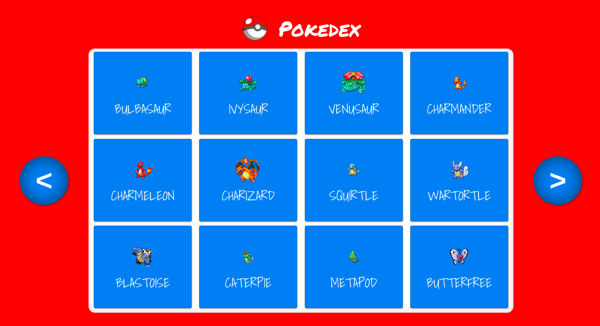
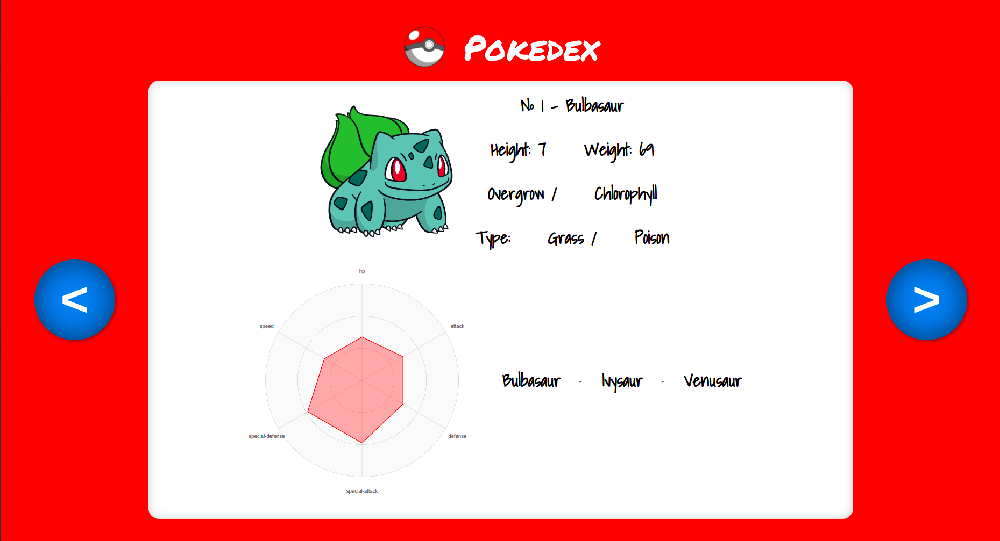
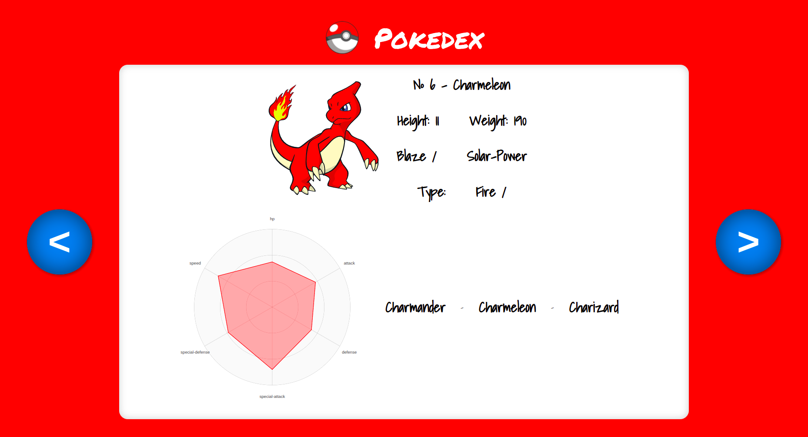
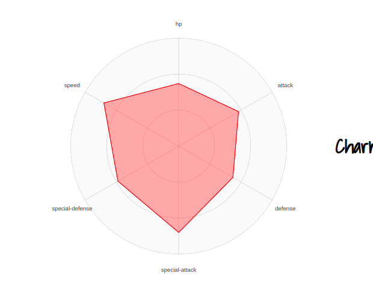

# Pokedex

Este projeto foi idealizado para servir de projeto integrador para aplicação dos conhecimentos adquiridos durante os estudos na trilha Sensedia Academy Alura.

Trata-se de uma aplicação React SPA que utiliza as tecnologias ***React Router*** e ***Styled Components*** e consome a api pública ***PokéApi***.

## Imagens do Projeto

Tela Inicial

Tela de Detalhes do Pokemon

Detalhes do Gráfico

## Dependências Externas

### PokéAPI

O projeto ***PokéAPI*** oferece API RESTful para objetos altamente detalhados construídos a partir de milhares de linhas de dados relacionados a Pokémon.*

**informação retirada do site [PokéAPI](https://pokeapi.co/about)*

### React SVG Radar Chart

Esta dependencia oferece uma implementação de um gráfico de radar em formato svg, leve, de fácil utilização e pronto para exibição.

### Axios

Axios é uma implementação de um cliente HTTP assíncrono em javacript.*

**informação retirada do repositório [github do projeto](https://github.com/axios/axios)*

## Scripts Disponíveis

Dentro da pasta do projeto, utilize:

### `npm start` ou `yarn start`

Para rodar o app em modo de desenvolvimento.\
Abra [http://localhost:3000](http://localhost:3000) para visualizar em seu navegador.

### `npm test` ou `yarn test`

Para rodar os testes.
